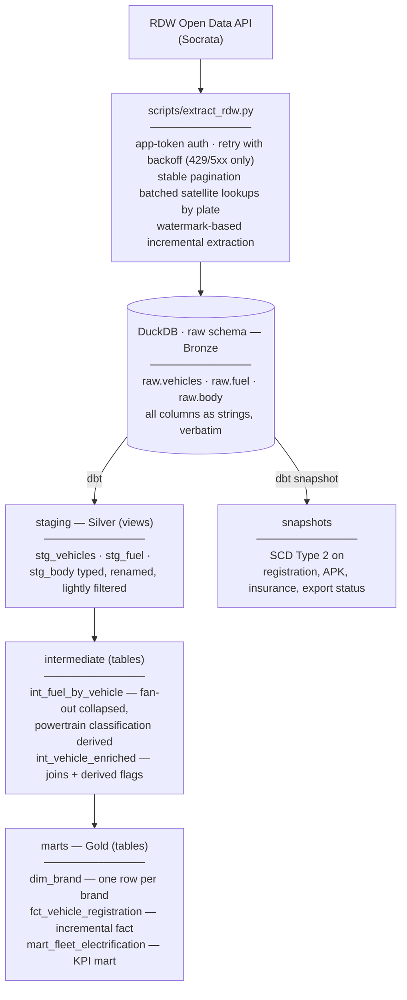

# RDW Fleet Analytics

An end-to-end ELT pipeline analysing the electrification of the Dutch
passenger car fleet, built on open data from the RDW (Netherlands Vehicle
Authority).

**Status: in active development.** Extraction, modelling, testing, and
validation are complete while orchestration (Airflow) and CI are in progress.

---

## What this project does

Extracts vehicle, fuel, and body data from the RDW Open Data API
(Socrata), lands it raw in DuckDB, transforms it through a layered dbt
project into a star schema, tracks vehicle state changes over time with
SCD Type 2 snapshots, and validates the headline output (BEV share of
registrations by year) against nationally published figures.

**Headline finding:** BEV share of first-time passenger car registrations
in this dataset rises from 0.75% (2015) to 13.88% (2020) to 17.33%
(2024), tracking the direction and acceleration of the nationally
reported electrification trend.

---

## Architecture

## Stack

| Component | Choice | Why |
|---|---|---|
| Extraction | Python (requests) | Retry, pagination, and batching logic under direct control |
| Storage/compute | DuckDB | Zero-infrastructure columnar engine, the whole warehouse is one file |
| Transformation | dbt Core | Layered models, testing, lineage, snapshots |
| Testing | dbt tests + dbt_utils | Grain assertions, accepted values, singular tests |

---

## Key numbers (current extract, 2026-07-31)

| Metric | Value |
|---|---|
| Vehicles | 300,000 (passenger cars, admission year 2010+) |
| Fuel rows | 359,438 |
| Body rows | 296,007 |
| Extract duration | 8m 17s |
| Fuel fan-out | 19.8% of vehicles have 2+ fuel rows |
| Body coverage gap | 1.3% of vehicles have no body record |
| Powertrain split | 215,707 ICE · 57,387 Hybrid/PHEV · 26,870 BEV · 36 FCEV |

---

## Engineering notes

**The fan-out problem.** The fuel dataset has one row per fuel type per
vehicle, 19.8% of vehicles have two or more (some have three,
e.g. a hybrid with an LPG conversion). A naive join inflates 300,000
vehicles into 359,438 rows, silently corrupting every downstream
aggregate. Resolved by collapsing fuel to vehicle grain in a dedicated
intermediate model, with a uniqueness test that fails immediately if the
fan-out is ever reintroduced. The derived powertrain classification was
cross-validated against RDW's own hybrid-class field and against
fuel-type row counts (FCEV count matches hydrogen fuel rows exactly).

**Incremental loading, twice.** The extract script uses a watermark
(max registration date already landed) so reruns only fetch new rows.
The fact table applies the same concept inside dbt with `is_incremental()`
filtering on `_extracted_at`, with delete+insert on a surrogate key.
Both verified idempotent, rerunning with no new data changes nothing.

**SCD Type 2.** Vehicle state (registration date, APK expiry, insurance,
export status) is tracked over time with a dbt snapshot (
the source has no reliable `updated_at`). Verified end to end: manually
updating one vehicle's APK date and re-snapshotting produced a correctly
closed old row and a new open row with exactly matching transition
timestamps — a gapless `[valid_from, valid_to)` interval.

**Schema discovery vs. reality.** A 50-row discovery sample found only
10 of the fuel dataset's 32 real columns. RDW populates different
fields per powertrain, and Socrata omits null fields from JSON entirely.
Staging models are verified against `describe` on landed data, not
discovery samples.

---

## Validation against national figures

Computed 2024 BEV share of first-time passenger car registrations in this
dataset: **17.33%**. Nationally reported 2024 BEV share of new passenger
car registrations (RVO/EAFO): **34.9%**.

The gap decomposes into three explained factors:

1. **Scope: parallel imports.** The national figure counts *new* car
   registrations; this dataset counts *first NL registrations*, which
   includes used vehicles imported from abroad. Imports skew heavily
   toward ICE. Excluding them (via the `is_import` flag — first admission
   >60 days before first NL registration) raises the 2024 BEV share to
   **26.79%**, closing more than half the gap on its own.

2. **Register snapshot vs. registration flow.** RDW's register reflects
   vehicles currently on the road, not a historical flow — cars
   registered in 2024 and since exported or scrapped have left the
   register, and BEVs and ICE vehicles need not exit at equal rates.

3. **Extraction sampling artifact.** The extract paginates via Socrata's
   `$order=:id` (an internal identifier, not chronological), so the
   300K-row cap under-represents 2024 specifically (9,615 vehicles vs. a
   typical 12–20K band per year — documented in the data dictionary). A
   fix (stratified per-year extraction) was identified but deliberately
   deferred given the project timeline.

Validation therefore reads: **17.33% raw → 26.79% scope-matched → 34.9%
national**, with the remaining gap attributable to factors 2 and 3, and
trend shape fully consistent throughout.

---

## Testing

35 data tests across all layers, including:

- **Grain assertions**: `unique`/`not_null` on every model's key;
  `unique_combination_of_columns` on composite grains (fuel staging,
  electrification mart)
- **Semantic invariants**: a singular test asserting every year's
  powertrain shares sum to 100%
- **Value constraints**: `accepted_values` on powertrain class and fuel
  type; `accepted_range` on percentages
- **Severity tiers**: expected register noise (154 of 300,000 vehicles
  lack a registration date) warns without blocking; genuine invariant
  violations error
- **Source freshness**: `_extracted_at` monitored against warn/error
  thresholds

---

## Orchestration setup (in progress)

Local Airflow running via Astro CLI (astronomer/astro-cli) + Docker
Desktop, in a separate project (`rdw-airflow/`). DAG connecting
extract -> snapshot -> dbt build -> source freshness in progress.

## Repository structure